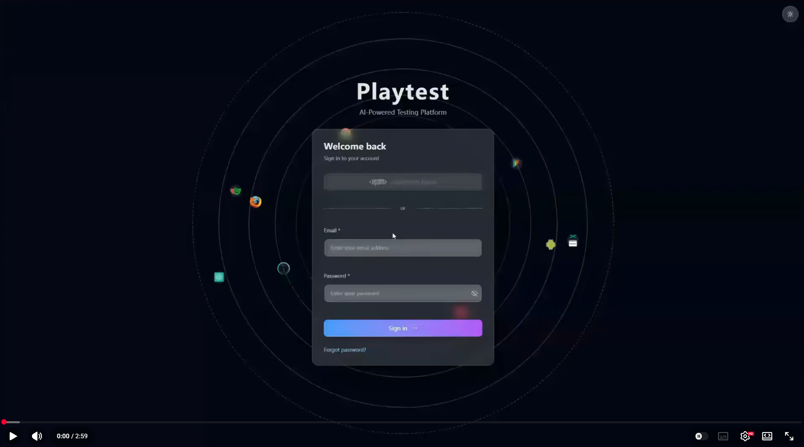

# Playtest

<div align="center">


[](https://www.youtube.com/embed/X69ADkzYytA?si=XKHdOd7sKKTm-V2g)


Playtest is an **AI-powered test automation workspace** built on **AI SDK**.

It helps teams move from *requirements* to *test cases* to *automation execution* using an agent that can call structured tools and stream results into interactive documents.

What makes Playtest different is the **Skills-based agent architecture**:

- **Prompts as files**: prompts and tool-usage rules live in markdown under `.agents/skills/*`.
- **Discoverable skills**: the runtime orchestrator discovers skills and can load specialized instructions on demand.
- **Tool-first execution**: business logic stays in TypeScript tools (DB writes, artifact creation, automation execution), while the agent focuses on planning and calling tools.

This project focuses on a **Skills-based agent architecture**: prompts and tool usage rules live in markdown under `.agents/skills/*`, while the runtime orchestrator discovers skills and enables tools dynamically.

</div>

## What you can build with Playtest

- **Test Authoring**: Using natural language to create test cases, generate test data, generate automated test scripts, and run automated tests.
- **Visual Testing**: Using AI visualization capabilities for automated testing can extend the available cycle of automated testing
- **Workflow Integration**: AI Agent workflow optimizes the testing process and integrates third-party services such as GitLab, Jira, and Squash.
- **Test Optimization**: The platform provides transformation functionality and utilizes Agent capabilities to batch optimize historical test cases


## Quick start

### Prerequisites

- Node.js 18+
- npm / pnpm / yarn

### 1) Install

```bash
npm install
```

### 2) Configure environment variables

Create `.env.local`:

```env
# Database
DB_PROVIDER=sqlite
DATABASE_URL=file:./data.db

# Auth (NextAuth)
NEXTAUTH_URL=http://localhost:3000
NEXTAUTH_SECRET=replace-with-a-random-secret

# AI Provider (choose one or multiple)
QWEN_API_KEY=
OPENAI_API_KEY=

# Confluence (optional)
CONFLUENCE_EMAIL=
CONFLUENCE_API_TOKEN=

# Misc
NEXT_TELEMETRY_DISABLED=1
```

Notes:

- `CONFLUENCE_API_TOKEN` is only required for private pages or external/share links.
- Never commit `.env.local`.

### 3) Run dev server

```bash
npm run dev
```

Open `http://localhost:3000`.


## Project structure

```text
.
├── .agents/skills/                 # Skills (SKILL.md + prompts + tools.json)
├── app/                            # Next.js App Router (pages + API routes)
├── artifacts/                      # Artifact handlers (server-side streaming)
├── components/                     # UI components
├── devops/                         # Dockerfiles, compose, helper scripts
├── hooks/                          # React hooks
├── lib/
│   ├── ai/
│   │   ├── agent/                  # Skills agent orchestrator
│   │   ├── prompts/                # Prompt loaders / legacy prompt glue
│   │   └── tools/                  # Tool implementations
│   ├── db/                         # DB + migrations
│   └── utils/                      # Helpers
└── public/
```

## Skills included (examples)

- `general-assistant`
- `testcase-authoring`
- `automation-config-generation`
- `execute-automation`
- `confluence-reader` (optional)

## Development

### Commands

```bash
npm run dev
```

### Adding a new skill

1. Create `.agents/skills/<skill-name>/SKILL.md`.
2. Add `.agents/skills/<skill-name>/tools.json` with `activeTools`.
3. Put prompts under `.agents/skills/<skill-name>/prompts/*.md`.

### Adding a new tool

1. Implement the tool in `lib/ai/tools/*`.
2. Register it in `lib/ai/tools/tool-config.ts`.
3. (Optional) Add it to a skill’s `tools.json`.

## Security

- Do not hardcode API keys.
- Confluence API token grants access to your workspace. Use a dedicated token with minimal access.
- Rotate `NEXTAUTH_SECRET` for production.

## Contributing

PRs are welcome. Please:

- Keep changes small and focused.
- Prefer markdown prompts under `.agents/skills/*` over inline prompt strings.

## License

MIT (see `LICENSE`).